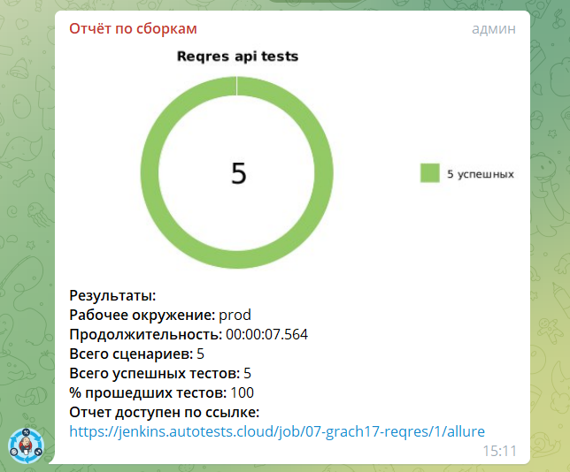

## Инструкция по запуску тестов

Запуск тестов происходит через джобу в [Jenkins](https://jenkins.autotests.cloud/job/07-grach17-reqres/)


### Run tests:

```bash
gradle clean test -Dthreads=5
```

### Serve report:

```bash
allure serve build/allure-results
```

## Оповещение о результатах прохождения тестов через бот в [телеграмм](https://t.me/autotest_result)



## Анализ результатов

Более подробно с результатми тестов можно ознакомиться в:

* Jenkins через Allure Reports
  (перейти по ссылке в отчете телеграм)

### Анализ результатов в Jenkins через Allure Reports


